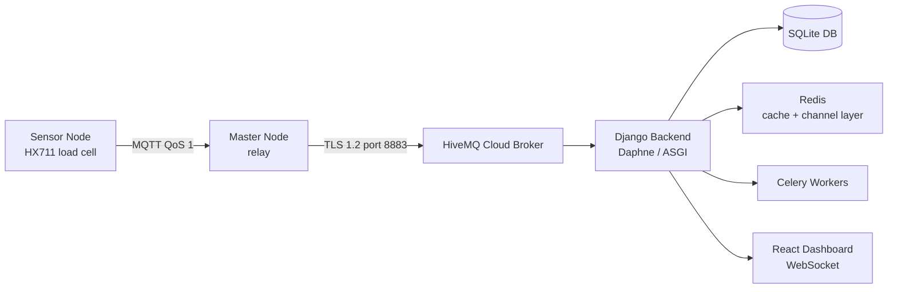
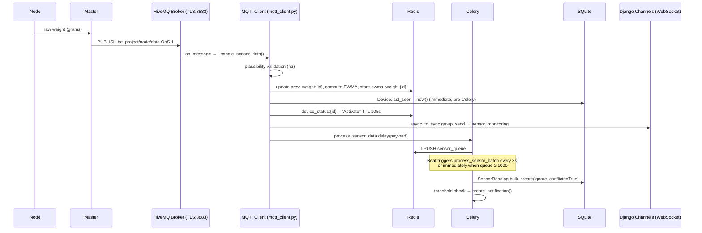
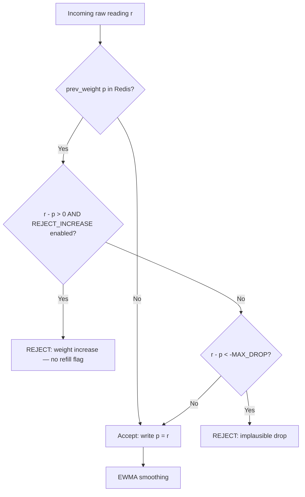
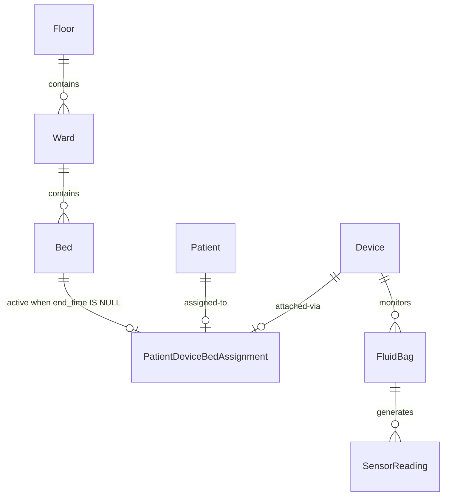
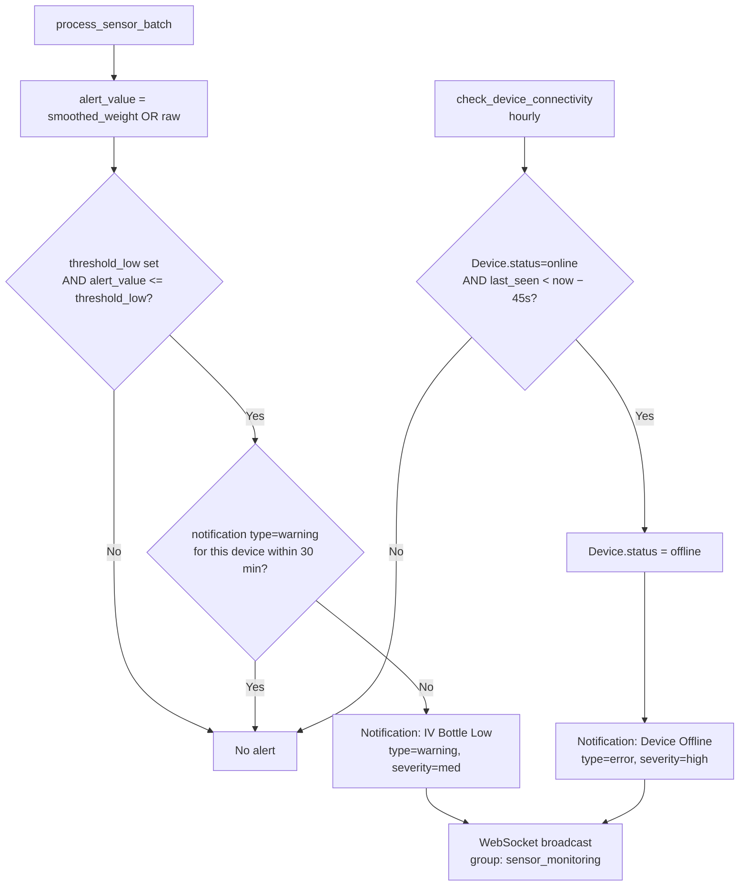
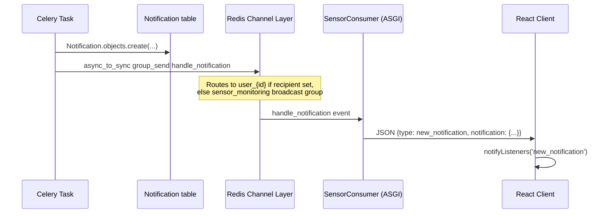
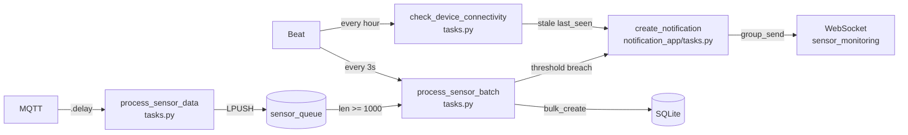

# FluidCare — Backend System Reference

*Prepared for academic research. All descriptions are derived directly from source code.
Unimplemented or unverifiable behaviour is enumerated in §10.*

---

## 1. System Overview

FluidCare is a real-time IoT monitoring system for hospital fluid management.
Wireless sensor nodes (HX711-based load cells) measure the weight of IV, blood, and urine bags
and transmit readings to a Django/Channels backend over MQTT. The backend performs
server-side signal validation, EWMA smoothing, persistent storage, threshold-based alerting,
and live WebSocket broadcast to a React dashboard.



**Stack:** Django 4.x, Django Channels (ASGI), Celery + Redis, Paho MQTT, SQLite (dev) / PostgreSQL (prod-ready), simplejwt authentication.

---

## 2. Ingestion Path

All device-to-backend traffic is MQTT. There is no HTTP ingestion endpoint for sensor readings.



### MQTT Topics (`mqtt_client.py:61–70`, `settings.py:342–351`)

| Topic | Protocol Code | Direction | Handler |
|---|---|---|---|
| `be_project/node/register` | 200 | Node → Backend | `handle_node_register` |
| `be_project/node/confirm_id` | 202 | Node → Backend | `handle_node_confirm` |
| `be_project/node/data` | 203 | Node → Backend | `_handle_sensor_data` → `process_sensor_data` |
| `be_project/node/task_complete` | 204 | Node → Backend | `handle_task_complete_request` |
| `be_project/node/erase_confirm` | 206 | Node → Backend | `handle_erase_confirm` |
| `be_project/disconnect` | 207 | Node → Backend | `process_disconnect` |
| `be_project/master/in` | 201/205 | Backend → Node | `publish_message()` |

All subscriptions use QoS 1. TLS uses `ssl.CERT_REQUIRED` with ISRG Root X1 CA (`mqtt_client.py:49–55`).

**Timestamp attribution:** Nodes carry no RTC. The backend stamps each payload with
`timezone.now()` at receipt (`mqtt_client.py:151`). All `SensorReading.timestamp`
values therefore represent server receipt time, not node measurement time.

---

## 3. Server-Side Validation Rules

Both checks execute synchronously inside `_handle_sensor_data()` (`mqtt_client.py:155–179`),
before EWMA computation and before the Celery queue. A rejected reading is logged and discarded;
no database write occurs.

State is maintained in Redis key `prev_weight:{node_id}`, TTL **3 000 s** (`mqtt_client.py:19–20, 180`).



### 3.1 Monotonic-Depletion Enforcement (Weight-Increase Rejection)

| Parameter | Default | Config key |
|---|---|---|
| Enable/disable | `True` | `SENSOR_REJECT_WEIGHT_INCREASE` (`settings.py:426`) |

If `Δ = raw − prev_raw > 0`, the reading is rejected (`mqtt_client.py:166–172`).
The system has no refill event mechanism; any weight increase is treated as sensor noise.

### 3.2 Implausible-Drop Rejection

| Parameter | Default | Config key |
|---|---|---|
| Maximum drop per interval | `50.0 g` | `SENSOR_MAX_DROP_G_PER_INTERVAL` (`settings.py:421`) |

If `Δ < −50.0 g`, the reading is rejected (`mqtt_client.py:173–179`).
The 50 g default is noted as covering "aggressive drip rates while blocking HX711 noise spikes" (`settings.py:419`).

Both thresholds are environment-configurable via `python-decouple`.

---

## 4. Signal Smoothing

**Algorithm:** Exponentially Weighted Moving Average (EWMA). No Kalman filter or other estimator is implemented.

| Constant | Value | Source |
|---|---|---|
| `EWMA_ALPHA` (α) | `0.2` | `mqtt_client.py:23` |

**Update equation** (`mqtt_client.py:187`):

```
ŵ_t = α · w_t + (1 − α) · ŵ_{t−1}
```

**Initialisation:** For the first accepted reading from a node, `ŵ_0 = w_0` (no prior state).

**State persistence:** EWMA accumulator stored in Redis key `ewma_weight:{node_id}`, TTL **3 000 s**.
State is lost if the key expires (e.g., device silent for > 50 min); next reading reinitialises from raw.

**Storage:** Both `reading` (raw, integer grams) and `smoothed_weight` (EWMA float) are persisted
to `SensorReading` on every accepted measurement (`tasks.py:356–366`).

**Alert and display preference:** The batch alert check uses
`alert_value = msg.get("smoothed_weight") or int(reading_value)` (`tasks.py:368`) — smoothed preferred,
raw as fallback. The dashboard uses `smoothedWeight ?? level` (`DeviceCard.jsx:22`).

---

## 5. Multi-Tenant / Per-Bed Scoping



Attribution chain: `SensorReading → FluidBag → Device → PatientDeviceBedAssignment → Bed → Ward → Floor`.

Active assignment predicate: `end_time__isnull=True`.

**Uniqueness constraints** enforced at both DB and application level (`models.py:121–153`):

| Constraint name | Scope |
|---|---|
| `unique_active_device_assignment` | One active assignment per device |
| `unique_active_bed_assignment` | One active assignment per bed |
| `unique_active_bed_device_assignment` | One active (bed, device) pair |

Ward and floor are auto-denormalised from the bed FK at assignment save time (`models.py:136–139`),
enabling efficient queries without repeated joins.

---

## 6. Data Model

### Device (`sensor_app/models.py:9–67`)

| Field | Type | Notes |
|---|---|---|
| `id` | UUID PK | auto, non-editable |
| `mac_address` | CharField(150) | db_index |
| `type` | CharField | `node` / `repeater` / `master` |
| `status` | CharField | `unassigned` / `online` / `offline` / `completed` |
| `last_seen` | DateTimeField | nullable; written per reading and by Celery |
| `installed_at` / `created_at` / `updated_at` | DateTimeField | audit fields |

### FluidBag (`sensor_app/models.py:69–88`)

| Field | Type | Notes |
|---|---|---|
| `device` | FK → Device | nullable |
| `type` | CharField | `iv_bag` / `blood_bag` / `urine_bag` |
| `capacity_ml` | PositiveBigIntegerField | nominal full volume |
| `threshold_low` | PositiveIntegerField | nullable; alert lower bound |
| `threshold_high` | PositiveIntegerField | nullable; overfill upper bound |

### SensorReading (`sensor_app/models.py:90–108`)

| Field | Type | Semantics |
|---|---|---|
| `fluid_bag` | FK → FluidBag | — |
| `reading` | PositiveIntegerField | **raw** weight, grams |
| `smoothed_weight` | FloatField (nullable) | **EWMA-filtered** weight, grams |
| `timestamp` | DateTimeField | server receipt time (auto_now_add) |
| `via` | BooleanField | True if relayed through repeater node |
| `battery_percent` | FloatField (nullable) | node battery at time of reading |
| `repeater_mac` / `master_mac` | CharField(150, nullable) | routing chain identifiers |

Default ordering: `-timestamp`. Composite index on `(fluid_bag, -timestamp)`.

### PatientDeviceBedAssignment (`sensor_app/models.py:110–158`)

| Field | Type | Notes |
|---|---|---|
| `patient` / `device` / `bed` / `ward` / `floor` | FK (nullable) | ward/floor auto-filled |
| `user` | FK → User (SET_NULL) | staff member who created assignment |
| `start_time` | DateTimeField | auto_now_add |
| `end_time` | DateTimeField (nullable) | null = currently active |

### Notification (`notification_app/models.py:4–73`)

| Field | Type | Notes |
|---|---|---|
| `recipient` | FK → User (nullable) | null → global delivery |
| `device` | FK → Device (nullable) | originating device |
| `source` | CharField | `system` (automated) / `admin` (manual) |
| `delivery_scope` | CharField | `global` / `all_users` / `role` / `user` |
| `notification_type` | CharField | `warning` / `info` / `error` |
| `severity` | CharField | `low` / `med` / `high` |
| `is_read` / `is_resolved` | BooleanField | client-side acknowledgement state |
| `retry_count` / `last_retry` | int / DateTimeField | for high-severity re-delivery |
| `patient_name` | CharField (nullable) | denormalised at creation time |

DB table: `sensor_app_notification` (non-default `db_table`).

---

## 7. Alerting Rules



### 7.1 Low-Fluid Alert

**Source:** `sensor_app/tasks.py:368–382` inside `process_sensor_batch`.

**Evaluated value:** `alert_value = msg.get("smoothed_weight") or int(reading_value)`
(smoothed preferred; raw fallback if smoothed is absent or zero).

**Condition:** `fluid_bag.threshold_low is not None AND alert_value <= fluid_bag.threshold_low`

**Debounce:** Suppressed if a `notification_type='warning'` record for the same device exists
with `created_at >= now − 30 min` (`tasks.py:371–374`).

**Delivery:** `create_notification()` → `send_notification_to_websocket()` →
`channel_layer.group_send("sensor_monitoring", ...)` (`notification_app/tasks.py:42–61`).

### 7.2 Device Offline Alert

**Source:** `sensor_app/tasks.py:630–679`, Celery task `check_device_connectivity`.

**Offline criterion:** `Device.status = 'online'` AND `Device.last_seen < now − 45 s`
(checked against DB, not Redis TTL). `OFFLINE_THRESHOLD_SECONDS = 45` (`tasks.py:39`).

**Active schedule:** `crontab(minute=0)` — every hour (`core/celery.py:33–35`).
See §9 for schedule conflict note.

**Output:** `Device.status → 'offline'`, `Notification(type='error', severity='high')`.

### 7.3 High-Severity Retry

**Source:** `notification_app/tasks.py:117–133`.

Re-pushes via WebSocket any `severity='high'`, `is_read=False`, `is_resolved=False` notification
where `retry_count < 2` and `now > last_retry + 5 min`. Maximum 2 retries per notification.

### 7.4 Frontend Alert Classification (`DeviceCard.jsx:30–38`)

Computed entirely client-side from `alertPercent = clamp(round((smoothedWeight ?? level) / capacity_ml × 100), 0, 100)`:

| Condition | Status | Colour |
|---|---|---|
| Device offline or `status=completed` | `offline` | grey |
| `alertPercent ≤ thresholdLow` | `critical` | red |
| `alertPercent ≤ thresholdLow × 1.2` | `warning` | yellow |
| `alertPercent ≥ thresholdHigh` | `overfill` | purple |
| otherwise | `normal` | green |

---

## 8. Notification Delivery Path



Admin notifications (`services.py:28–47`): one `Notification` row per recipient;
one WebSocket push per row. System alerts: one row, `recipient=None`, `delivery_scope='global'`.

---

## 9. API Surface

### REST — Sensor (`/api/sensor/`, `sensor_app/urls.py`)

| Method | Endpoint | Auth | Description |
|---|---|---|---|
| GET | `devices/` | None | All devices with active assignments |
| POST | `devices/register/` | **None** | Create device-patient-bed assignment; sends Code 201 to master |
| GET | `devices/{uuid}/patient-details/` | JWT | Current patient for device |
| GET | `devices/{uuid}/patient-history/` | None | Full assignment history |
| GET | `devices/{uuid}/device-history/` | None | Device assignment history |
| GET | `devices/{uuid}/history/?hours=N` | JWT | `SensorReading` records (default 24 h) |
| GET | `dashboard/` | None | Renders legacy `sensor_monitor.html` template |

### REST — Notifications (`/api/notification_app/`, `notification_app/urls.py`)

| Method | Endpoint | Auth | Description |
|---|---|---|---|
| GET | `notifications/` | JWT | Unread/unresolved for caller + global (limit 50) |
| GET | `notifications/history/` | JWT | Read/resolved (limit 100) |
| GET | `notifications/admin-history/` | JWT admin/manager | Admin-created notifications |
| POST | `notifications/send/` | JWT root_admin/manager | Create manual notification |
| POST | `notifications/{id}/read/` | JWT | Set `is_read=True` |
| POST | `notifications/{id}/resolve/` | JWT | Set `is_resolved=True`, `is_read=True` |
| POST | `notifications/read-all/` | JWT | Bulk `is_read=True` for caller |

### REST — Hospital (`/api/hospital/`, `hospital_app/urls.py`)

Floor/Ward/Bed CRUD, Patient CRUD, admission, discharge, assignment history.

### WebSocket (`ws://host/ws/sensors/?token=<JWT>`, `sensor_app/routing.py`)

**On connect:** server pushes `initial_data` snapshot (all active assignments, admitted patients, hospital structure).

**Server → client message types:**

| `type` | Trigger | Key fields |
|---|---|---|
| `connection_established` | Handshake | `message` |
| `initial_data` | Connect | `devices`, `patients`, `hospitalStructure` |
| `sensor_data` | Per accepted reading | `nodeId`, `level` (raw), `smoothedWeight`, `timestamp`, `status`, `via`, `repeaterMac`, `masterMac` |
| `node_id_request` | Code-200 register | `mac` |
| `refresh_devices` | Device status change | `device_id` |
| `new_notification` | Notification created | full serialised `Notification` |
| `refresh_notifications` | Notification list changed | — |

**Client → server:** `subscribe_floor` / `unsubscribe_floor` messages are sent by the frontend
but are silently ignored by `SensorConsumer.receive()` — no floor-level filtering is implemented.

---

## 10. Celery Task Architecture & Beat Schedule



**Active beat schedule** — defined in `core/celery.py:25–35` via `app.conf.beat_schedule = {...}`
which **overwrites** `settings.CELERY_BEAT_SCHEDULE` at startup:

| Entry | Task | Schedule |
|---|---|---|
| `process-sensor-batch-every-3-seconds` | `sensor_app.tasks.process_sensor_batch` | 3 s |
| `check-device-connectivity` | `sensor_app.tasks.check_device_connectivity` | `crontab(minute=0)` — hourly |

`settings.py:428–436` defines a separate `CELERY_BEAT_SCHEDULE` with a 30 s connectivity check
and a 150 s high-severity retry, but the `celery.py` assignment replaces the entire dict,
rendering those entries inactive at runtime.

**Batch mechanics:** `process_sensor_data` pushes to Redis list `sensor_queue`.
`process_sensor_batch` pops up to `MAX_BATCH_PROCESS = 5000` items, resolves devices and
fluid bags in bulk (`in_bulk`), and writes via `bulk_create(ignore_conflicts=True)` inside a
single `transaction.atomic()`. A distributed Redis lock (`LOCK_KEY`, 20 s TTL) prevents
concurrent batch runs. On `DatabaseError`, items are re-queued via `LPUSH`.

---

## 11. Open Issues / Could Not Verify

1. **`process_alert` task is dead code.** `notification_app/tasks.py:65–107` implements
   threshold checks for blood/urine bags but is never invoked — no `.delay()` call exists
   anywhere in the codebase. High-level blood/urine bag server-side alerts are unimplemented.

2. **`send_alert_notification` is a stub.** `notification_app/tasks.py:111–114` body is `pass`
   with a TODO comment. SMS/email delivery is not implemented.

3. **Beat schedule conflict renders 30 s offline detection and high-severity retry inactive.**
   `core/celery.py:app.conf.beat_schedule = {...}` overwrites `settings.CELERY_BEAT_SCHEDULE`,
   so the 30 s connectivity check and the 150 s retry task never run.
   The active offline check runs hourly, while the offline threshold is 45 s — creating a
   window of up to ~60 minutes where an offline device produces no alert.

4. **`threshold_low` / `threshold_high` unit ambiguity.** The server alert in `tasks.py:369`
   compares `alert_value` (grams) against `fluid_bag.threshold_low` (plain integer, no unit).
   The frontend `DeviceCard.jsx:33–36` interprets the same DB fields as percentage of capacity.
   These two interpretations are mutually exclusive for any non-trivial capacity value.

5. **`POST /api/sensor/devices/register/` is unauthenticated.** `views.py:151` carries no
   `@permission_classes([IsAuthenticated])` decorator. Any network-reachable caller can
   create or reassign device-patient-bed records.

6. **Floor-subscription messages silently dropped.** `SensorConsumer.receive()` parses the
   `type` field but dispatches nothing (`consumers.py:84–90`). Floor-level feed filtering
   is absent; all clients receive all device updates.

7. **`sensor_monitor.html` is broken.** Listens for `type === 'sensor_update'`
   (`sensor_monitor.html:68`) but the channel emits `type === 'sensor_data'`. Field names
   `data.fluid_level` and `data.fluid_bag_type` do not exist in the current payload schema.
   The template is superseded by the React frontend.

8. **`get_sensor_history_view` is unmounted.** `views.py:113–129` defines a history endpoint
   that returns only `reading + timestamp` (no `smoothed_weight`) and is not registered in
   `urls.py`. Dead code.

---

## Files Read

```
backend/sensor_app/models.py
backend/sensor_app/mqtt_client.py
backend/sensor_app/views.py
backend/sensor_app/consumers.py
backend/sensor_app/tasks.py
backend/sensor_app/utils.py
backend/sensor_app/helperFunction.py
backend/sensor_app/serializers.py
backend/sensor_app/urls.py
backend/sensor_app/routing.py
backend/notification_app/models.py
backend/notification_app/tasks.py
backend/notification_app/views.py
backend/notification_app/urls.py
backend/notification_app/services.py
backend/hospital_app/models.py
backend/hospital_app/urls.py
backend/auth_app/models.py
backend/core/settings.py
backend/core/urls.py
backend/core/celery.py
backend/core/asgi.py
backend/templates/sensor_monitor.html
frontend/src/api/websocket.js
frontend/src/api/helperFunctions.js
frontend/src/components/DeviceCard.jsx
frontend/src/hooks/useSensorWebSocket.js
```
